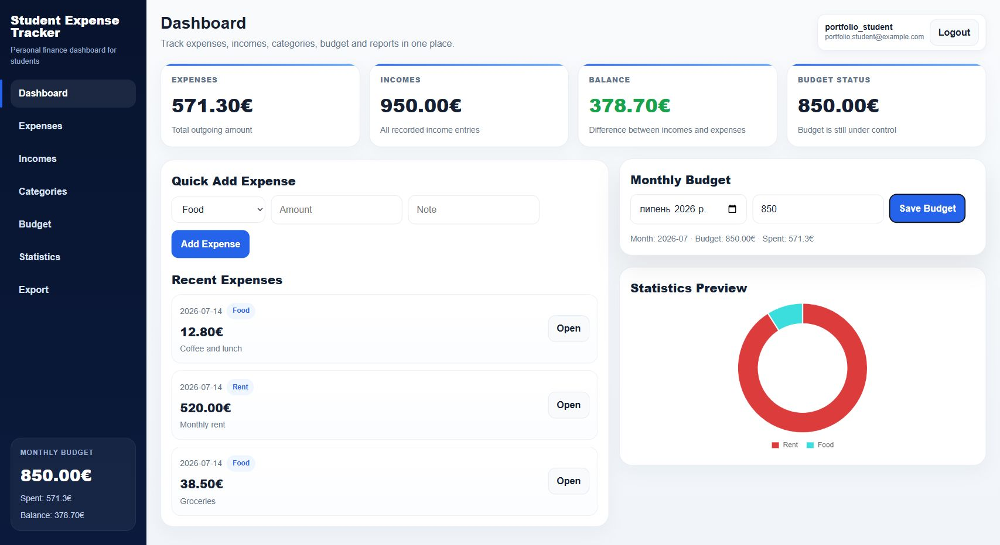

# Student Expense Tracker

A full-stack personal-finance dashboard designed for students. Built as a course project, it combines authenticated expense and income tracking, monthly budgets, charts, filtering, and exports in one responsive interface.



## Highlights

- Secure registration and JWT-based login
- Expenses and incomes with categories, notes, filters, editing, and deletion
- Monthly budget tracking with live balance and spending status
- Dashboard summaries and Chart.js visualizations
- CSV export for personal reporting
- PostgreSQL schema migration for precise decimal amounts
- Docker Compose setup for the complete stack
- Frontend lint/build and backend syntax checks in CI

## Stack

- React 19, Vite, Chart.js
- Node.js, Express, PostgreSQL
- Docker Compose

## Run locally

```bash
docker compose up --build
```

The services will be available at:

- Frontend: `http://localhost:5173`
- Backend API: `http://localhost:3000`
- PostgreSQL: `localhost:5432` (`app` / `app`, database `expenses`)

The backend upgrades existing amount columns to `NUMERIC(12, 2)` on startup, so existing Docker volumes can be reused safely.

## Verify

```bash
cd frontend && npm ci && npm run lint && npm run build
cd ../backend && npm ci && npm test
```
